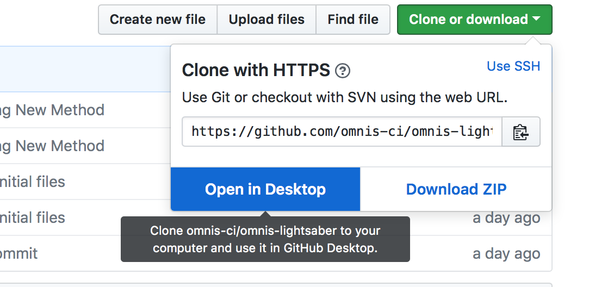
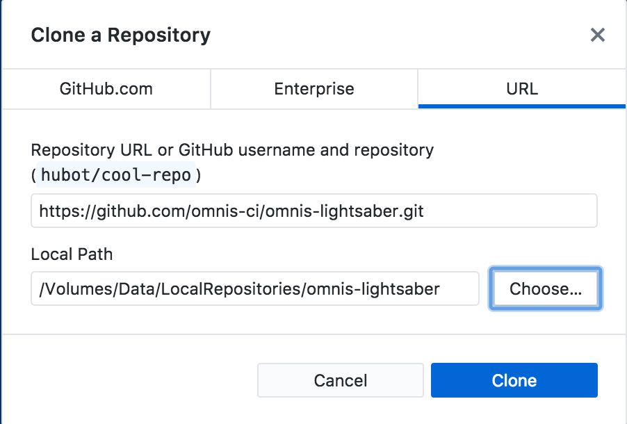
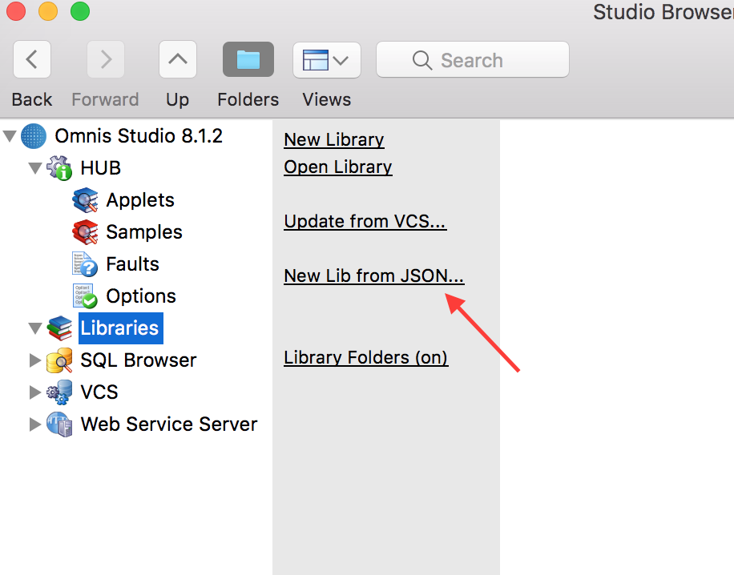
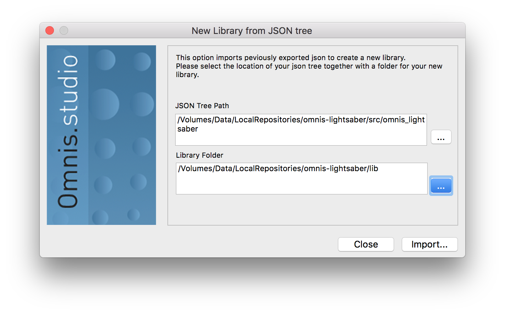
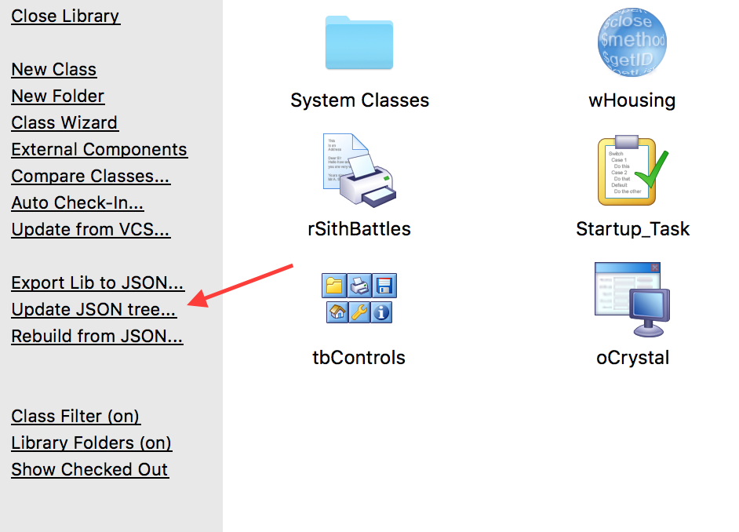
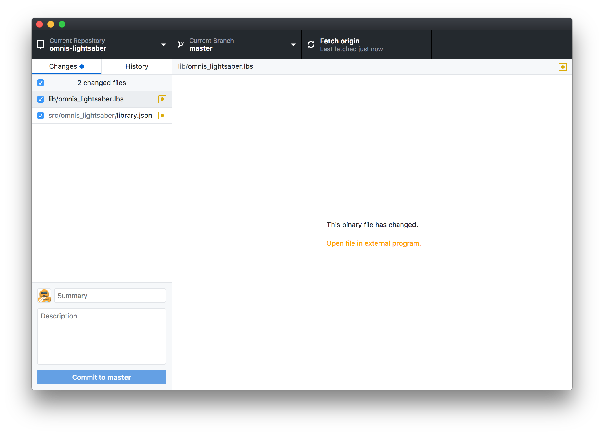

# Prerequisites
* Omnis Studio 8.1 or later
* GitHub Client

# Fork repository
To contributo a library you have to fork its repository. This means that a copy of the repository is made to your github account. This forked repository is link to the orginal one. This way it is possible to merge any changes made in te forked one with a pull request (explained below).

Follow the steps below to fork a repository
1. Go on GitHub to the repository to be forked.
1. Click on the button 'Fork'.

# Clone forked repository
Now the forked repository has to be cloned locally to get the (JSON) source. The steps describe the proces with the GitHub desktop app.

1. Click on the green button 'Clone / Download'. 

1. A popup appears. Click 'Open in Desktop'. 

1. It will asked to open the GitHub app. Click 'Allow'.
1. The GitHub app is opend with a window 'Clone a Repository'. 

1. Everything is good to go. Maybe you want to change the folder in which the repository will be cloned. Click on 'Choose' to correct this.
1. Click on 'Clone'. 

# Import Library into Omnis
Now the forked repository is cloned  it is possible to create a library from the source in Omnis Studio.

1. Open Omnis Studio.
1. Click in the Studio browser on 'New Lib From JSON'.

1. Click on the '...' button next to 'JSON Tree Path'.

1. Goto the folder in the repository where the file library.json resides and click on 'Choose'.
1. Click on the '...' button next to 'Library Folder' and choose a folder where the Library has to be created.
1. Click on 'Import...'. If there are any errors occuring check the 
[Troubleshooting](#errors-at-importing-and-exporting-libraries) section below for more information.

# Update forked repository
After the change in the library are made they have to be added and uploaded (pushed) to the forked repository.

## Update JSON tree
Click in Omnis Studio the option 'Update JSON tree'. This will export the changed Omnis code to JSON.

## Commit and push to forked repository
Use the GitHub app to commit and push the changes to the fork repository with the steps below

1. Open the forked repository in the GitHub app
1. Review your changes and enter a summary and a description and click 'Commit to master'.

1. Click on 'Push to origin' to upload the changes to repository on GitHub.

# Create pull request
Finally a pull request has to be made in order to notify the owner of the original repository that you have made changes and want them to be merged into his repository.

1. In the GitHub app click on the menu 'Branch' and then on 'Create pull request' This opens GitHub in the browser (If menu option is grayed out. See [Troubleshooting](#unable-to-create-pull requests) section).

1. Click 'Create pull request'.

1. Enter a descripton for the pull request.
1. And click 'Create pull request'.
1. It is now to the owner of the original repository to descide if he accepts the changes. See the [About pull requests](https://help.github.com/articles/about-pull requests/) documentation of GitHub for more informtion.

# Troubleshooting
## Errors at importing and exporting libraries
### Output Library already exists
Most likely the choosen folder for the libary is the same as the one cloned from the forked repository. Either rename the existing library, remove it or choose another folder.

### Import requires external library to be open
One of the erros that can occur is that the library to be exported / imported is depended to an other library. This can be solved to open/import the other library in Omnis Studio.

### Unable to create pull requests
If the menu line 'Create pull requests' is grayed out, then probably the repository is added as a local repository to the app. To enable the 'Create pull requests' menu line the repository has to be cloned from GitHub from within the GitHub app.
[../images/fork_repository.png]: 
(../images/os-new_lib_json.png): 

